Below is a clean **copy-paste ready `README.md`** with actual results, tables, and images from your run.

````markdown
# Video Codec Validation Lab

Yash Daniel Ingle | yashingle1207@gmail.com | github.com/yashingle1207 | LinkedIn

## Overview

This project is a C++/Python video codec validation lab built to test how compressed video outputs behave across H.264/AVC, HEVC/H.265, and AV1.

I built it as a practical validation harness, not just an encoding script. The pipeline generates controlled raw YUV420p inputs, runs codec sweeps with FFmpeg, decodes the compressed outputs, checks stream metadata with ffprobe, computes PSNR/SSIM/VMAF, applies YAML pass/fail thresholds, and generates reports and plots for codec comparison.

The main goal was to practice the kind of validation flow used in video compression and silicon validation work: controlled inputs, repeatable tests, measurable quality, clear failure reasons, and visual evidence.

## What This Project Validates

Video encoder validation is more than checking whether a file plays. A useful validation flow should answer:

- Did the encode complete successfully?
- Is the output bitstream decodable?
- Does the decoded frame count match the expected frame count?
- Are codec metadata, pixel format, resolution, bitrate, and duration sane?
- Are GOP and keyframe patterns visible and consistent?
- Do PSNR, SSIM, and VMAF meet expected thresholds?
- How do bitrate, quality, file size, and encode time change across codec settings?
- Which codec is more efficient across an RD curve?

This project answers those questions with automated scripts, reports, and plots.

## Validation Architecture

```text
Raw YUV420p Input
        |
        v
FFmpeg Encoder
        |
        v
Compressed Bitstream
        |
        v
Decode Verification
        |
        v
ffprobe Bitstream / GOP Analysis
        |
        v
PSNR / SSIM / VMAF Quality Evaluation
        |
        v
YAML Pass/Fail Thresholds
        |
        v
JSON / CSV Reports
        |
        v
RD Curves + BD-Rate Comparison
````

Core modules:

```text
codec_encoder.py         FFmpeg CRF/CBR encode wrapper
bitstream_decoder.py     Decode verification and frame-count checks
bitstream_analyzer.py    ffprobe metadata, frame type, GOP, keyframe, and bitrate analysis
quality_evaluator.py     PSNR, SSIM, and VMAF metric evaluation
rd_curve_analyzer.py     BPP, RD curve, and BD-rate utilities
pipeline_utils.py        Config loading, directory setup, and pass/fail threshold logic
yuv_frame_validator.cpp  C++ YUV420p frame statistics and SHA-256 validator
```

## What I Built

* A repeatable video codec validation pipeline for H.264/AVC, HEVC/H.265, and AV1.
* C++ YUV420p validator for frame count, luma/chroma statistics, SHA-256 fingerprints, black/frozen frames, clipping, and truncation checks.
* Python automation for encode, decode, metric extraction, threshold validation, and report generation.
* ffprobe-based bitstream metadata and GOP/keyframe analysis.
* PSNR, SSIM, and VMAF quality evaluation.
* YAML-based pass/fail validation rules.
* JSON/CSV validation reports.
* RD curves and BD-rate style comparison matrices.
* README-ready plot images under `docs/images/`.
* Lightweight pytest coverage for command construction, parsing, thresholds, RD/plot helpers, and validation logic.

## Generated Test Clips

The repository does not commit large media files. Instead, the pipeline generates deterministic YUV420p clips locally using FFmpeg lavfi sources.

| Clip                            | Resolution | Frames | FPS | Purpose                                |
| ------------------------------- | ---------: | -----: | --: | -------------------------------------- |
| `test_352x288_30fps_150f.yuv`   |    352x288 |    150 |  30 | Fast smoke-test input for codec sweeps |
| `test_1280x720_30fps_150f.yuv`  |   1280x720 |    150 |  30 | Practical HD comparison input          |
| `test_1920x1080_30fps_100f.yuv` |  1920x1080 |    100 |  30 | High-detail stress input               |
| `black_352x288_30fps_60f.yuv`   |    352x288 |     60 |  30 | Black/frozen-frame corner case         |
| `white_352x288_30fps_60f.yuv`   |    352x288 |     60 |  30 | Clipping/saturation corner case        |

For the current codec sweep results shown below, the pipeline uses the 352x288 smoke-test input so the full validation run stays lightweight and repeatable on a local machine.

## Current Validation Result

The latest local run completed successfully.

| Check                  | Result       |
| ---------------------- | ------------ |
| Unit tests             | 32 passed    |
| Codec sweep rows       | 18           |
| Encode success         | 18 / 18      |
| Decode success         | 18 / 18      |
| Frame-count check      | 18 / 18      |
| Bitstream integrity    | 18 / 18      |
| GOP metadata populated | Yes          |
| PSNR populated         | Yes          |
| SSIM populated         | Yes          |
| VMAF populated         | Yes          |
| Final pass result      | 18 / 18 pass |

## Average Results by Codec

These values come from the generated `validation_summary.csv` after running the full validation pipeline.

| Codec        | Avg BPP | Avg PSNR-Y | Avg SSIM | Avg VMAF | Avg Encode Time (s) | Avg File Size (MB) |
| ------------ | ------: | ---------: | -------: | -------: | ------------------: | -----------------: |
| AV1 / libaom |  0.0810 |    37.5347 |   0.9636 |  78.5046 |              7.0053 |             0.1469 |
| H.264 / x264 |  0.0920 |    37.4060 |   0.9688 |  86.1305 |              0.1725 |             0.1667 |
| HEVC / x265  |  0.0923 |    37.6277 |   0.9719 |  88.8227 |              0.6196 |             0.1673 |

For this specific lightweight test clip and encoder configuration, AV1 produced the lowest average BPP but took the longest to encode. HEVC had the strongest average SSIM/VMAF in this run. These results are not meant to be a universal codec ranking; they are the measured result for this controlled test setup.

## Rate-Distortion Curves

Rate-distortion curves show quality versus bitrate efficiency. In these plots, the x-axis is BPP and the y-axis is a quality metric. A better curve is generally higher and more to the left, meaning better quality at lower bitrate.

### PSNR RD Curve

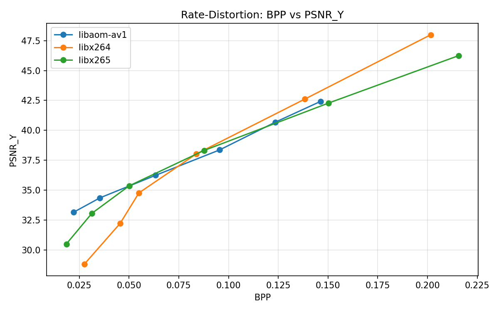

### SSIM RD Curve

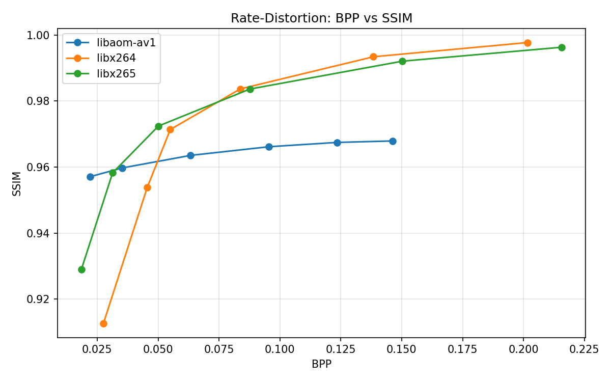

### VMAF RD Curve

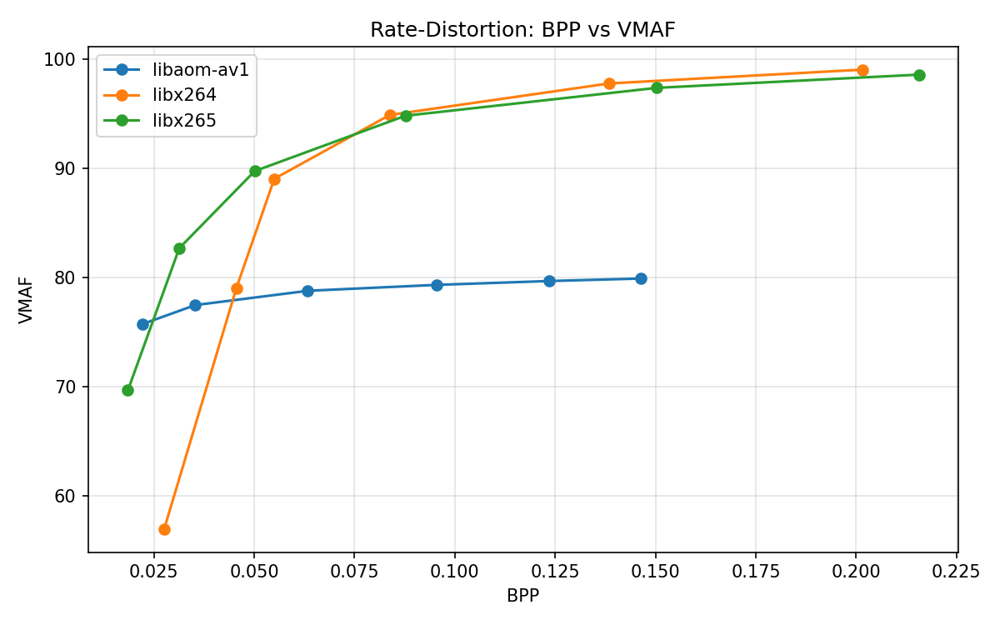

## CRF Trends

The CRF sweep shows how quality and bitrate change as compression becomes stronger.

### CRF vs PSNR

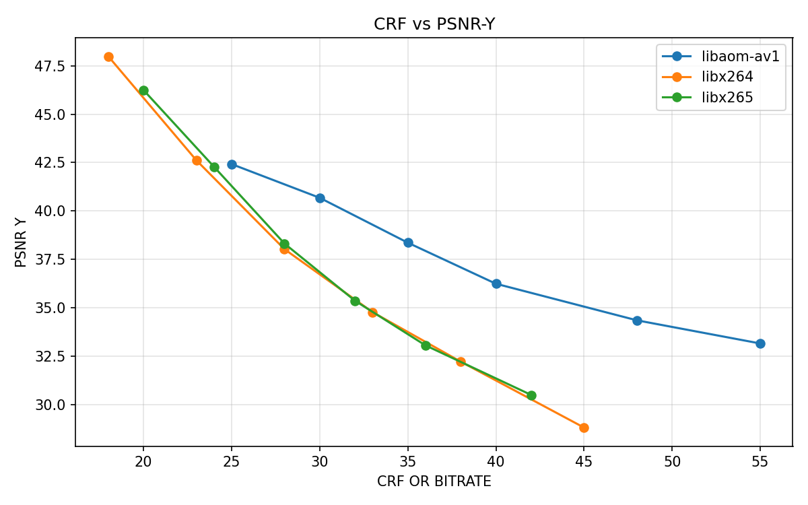

As CRF increases, the encoder applies stronger compression, so PSNR generally drops.

### CRF vs BPP

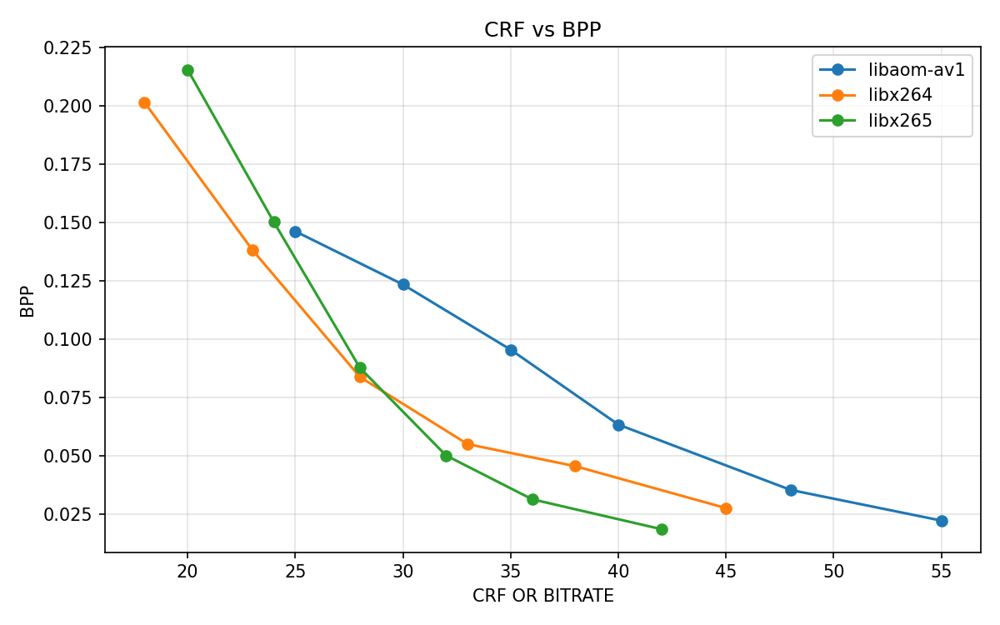

As CRF increases, bits per pixel generally decrease, which means smaller compressed output.

## Runtime and File Size Comparison

### Encode Time

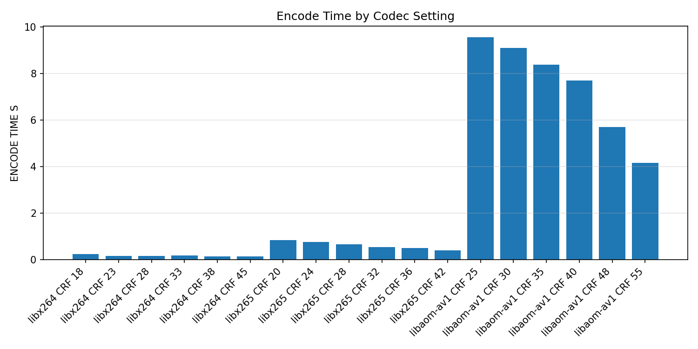

This shows the expected software encode tradeoff. x264 is very fast, x265 is slower, and AV1/libaom is much slower in this local software setup.

### Encoded File Size

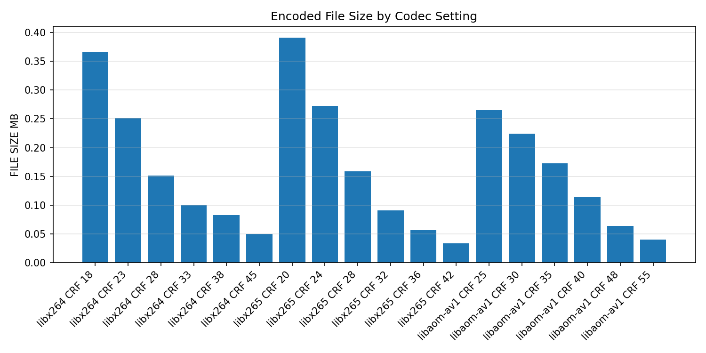

This compares compressed output size across codec and CRF settings.

## Pass/Fail Summary

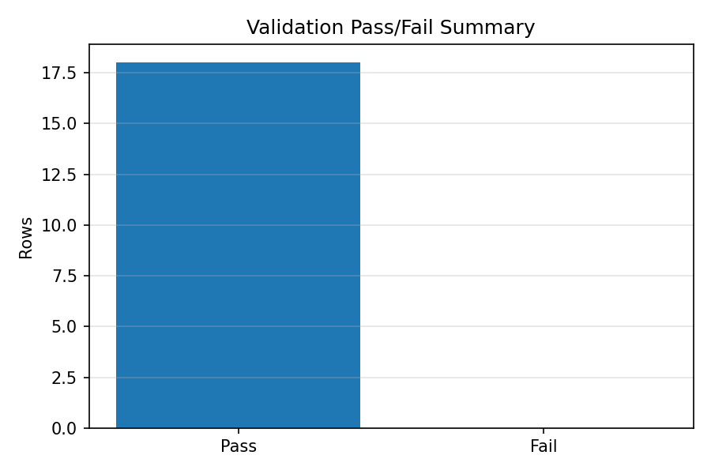

The current baseline validation sweep passes all generated rows. The normal codec sweep is intentionally clean; generated outputs are expected to pass when encode, decode, frame count, metadata, and quality thresholds are satisfied.

## BD-Rate Style Comparison

BD-rate summarizes average bitrate difference between two rate-distortion curves over their overlapping quality range.

How to read the matrices:

* Rows are the test codec.
* Columns are the reference codec.
* Negative means the row codec used less bitrate than the column codec for similar quality.
* Positive means the row codec needed more bitrate.
* These values are specific to the test input, encoder settings, and metric used.

### PSNR BD-Rate Matrix

| Test \ Ref   | AV1 / libaom | H.264 / x264 | HEVC / x265 |
| ------------ | -----------: | -----------: | ----------: |
| AV1 / libaom |         0.00 |        -7.97 |       -1.78 |
| H.264 / x264 |         8.66 |         0.00 |       10.26 |
| HEVC / x265  |         1.81 |        -9.31 |        0.00 |

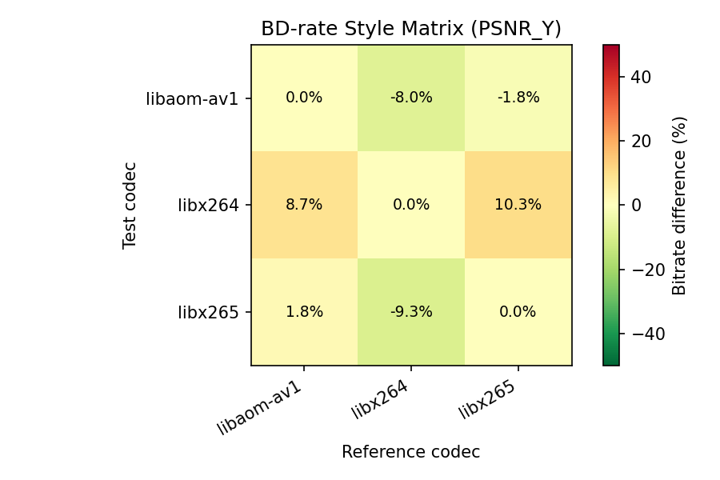

### SSIM BD-Rate Matrix

| Test \ Ref   | AV1 / libaom | H.264 / x264 | HEVC / x265 |
| ------------ | -----------: | -----------: | ----------: |
| AV1 / libaom |         0.00 |         8.51 |       50.19 |
| H.264 / x264 |        -7.84 |         0.00 |       29.63 |
| HEVC / x265  |       -33.42 |       -22.85 |        0.00 |

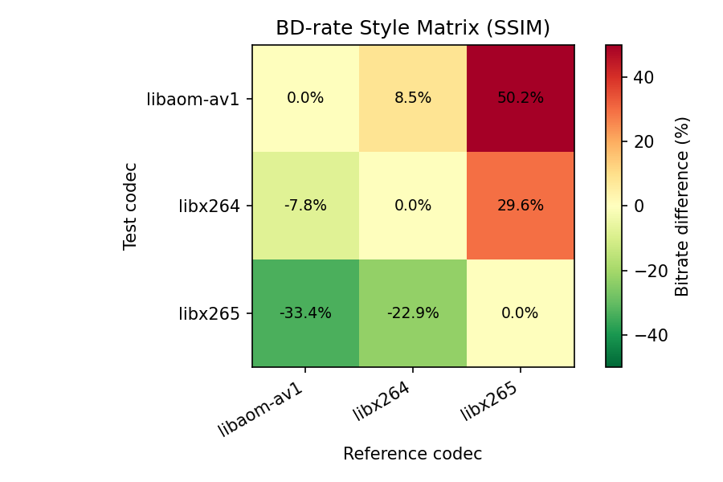

### VMAF BD-Rate Matrix

| Test \ Ref   | AV1 / libaom | H.264 / x264 | HEVC / x265 |
| ------------ | -----------: | -----------: | ----------: |
| AV1 / libaom |         0.00 |         4.43 |       79.76 |
| H.264 / x264 |        -4.24 |         0.00 |       36.87 |
| HEVC / x265  |       -44.37 |       -26.94 |        0.00 |

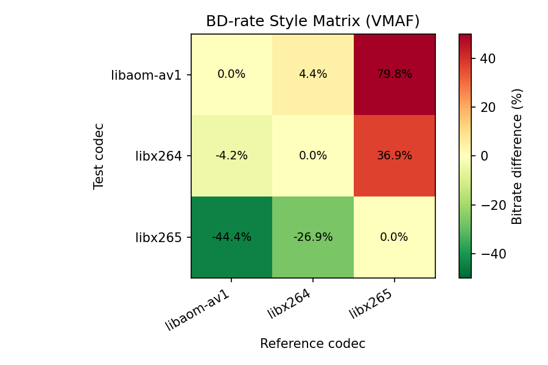

In this run, the BD-rate results differ depending on whether PSNR, SSIM, or VMAF is used. That is expected because each metric measures quality differently. This is one reason the project reports multiple metrics instead of relying on a single number.

## Reports Generated Locally

The pipeline writes machine-readable outputs under `outputs/`:

```text
outputs/encoded/     Encoded H.264, HEVC, and AV1 bitstreams
outputs/decoded/     Decoded YUV outputs
outputs/metrics/     PSNR logs, SSIM logs, and VMAF JSON
outputs/reports/     JSON and CSV validation summaries
outputs/plots/       Generated plot images and BD-rate CSVs
```

These generated files are ignored by git because they can be reproduced locally and can become large. The small README-ready images are stored in `docs/images/`.

## Project Structure

```text
video-codec-validation-lab/
|-- .gitattributes
|-- .gitignore
|-- Makefile
|-- README.md
|-- requirements.txt
|-- src/
|   |-- __init__.py
|   |-- codec_encoder.py
|   |-- bitstream_decoder.py
|   |-- bitstream_analyzer.py
|   |-- quality_evaluator.py
|   |-- rd_curve_analyzer.py
|   |-- pipeline_utils.py
|   `-- yuv_frame_validator.cpp
|-- scripts/
|   |-- generate_synthetic_clips.sh
|   |-- run_validation_pipeline.sh
|   |-- generate_validation_plots.py
|   |-- generate_rd_analysis.py
|   `-- yuv_sequence_scaler.py
|-- config/
|   |-- h264_avc_crf_sweep.yaml
|   |-- h265_hevc_crf_sweep.yaml
|   |-- h265_hevc_cbr_ladder.yaml
|   |-- av1_libaom_crf_sweep.yaml
|   `-- validation_thresholds.yaml
|-- tests/
|   |-- test_codec_encoder.py
|   |-- test_bitstream_decoder.py
|   |-- test_bitstream_analyzer.py
|   |-- test_quality_evaluator.py
|   |-- test_pipeline_utils.py
|   |-- test_rd_and_plots.py
|   `-- test_yuv_frame_validator.py
|-- docs/
|   |-- codec_notes.md
|   |-- metrics_reference.md
|   |-- validation_methodology.md
|   |-- experiment_log.md
|   `-- images/
|       |-- rd_curve_psnr.png
|       |-- rd_curve_ssim.png
|       |-- rd_curve_vmaf.png
|       |-- crf_vs_psnr.png
|       |-- crf_vs_bpp.png
|       |-- encode_time_comparison.png
|       |-- file_size_comparison.png
|       |-- validation_pass_fail_summary.png
|       |-- bd_rate_matrix_psnr.png
|       |-- bd_rate_matrix_ssim.png
|       `-- bd_rate_matrix_vmaf.png
|-- data/
|   `-- raw_yuv/
|       `-- README.md
`-- outputs/
    |-- encoded/.gitkeep
    |-- decoded/.gitkeep
    |-- metrics/.gitkeep
    |-- plots/.gitkeep
    `-- reports/.gitkeep
```

## Requirements

Install Python dependencies:

```bash
python -m pip install -r requirements.txt
```

External tools:

* `ffmpeg`
* `ffprobe`
* `g++`
* `make` optional, useful on Linux/macOS/Git Bash/MSYS2

On Windows, use Git Bash/MSYS2/WSL for `.sh` scripts, or run the Python modules directly.

VMAF support depends on the local FFmpeg build including `libvmaf`.

## Quick Start

```bash
git clone https://github.com/yashingle1207/video-codec-validation-lab.git
cd video-codec-validation-lab
python -m pip install -r requirements.txt
```

Build the C++ validator:

```bash
make build
```

If `make` is unavailable on Windows:

```bash
mkdir -p build
g++ -std=c++14 -O2 -Wall -Wextra -o build/yuv_frame_validator.exe src/yuv_frame_validator.cpp
```

Generate test clips:

```bash
bash scripts/generate_synthetic_clips.sh
```

Run the validation pipeline:

```bash
bash scripts/run_validation_pipeline.sh
```

Generate plots:

```bash
python scripts/generate_validation_plots.py
python scripts/generate_rd_analysis.py
```

Run tests:

```bash
python -m pytest -v
```

## Validation Methodology

The validation pipeline applies checks across several layers:

| Layer      | What is checked                                                 |
| ---------- | --------------------------------------------------------------- |
| Input      | Raw YUV420p dimensions, frame count, deterministic test sources |
| Encode     | FFmpeg command construction, output existence, file size        |
| Decode     | Reference decode to YUV and frame-count consistency             |
| Bitstream  | codec, profile, pixel format, resolution, duration, bitrate     |
| GOP        | frame types, keyframes, GOP count, GOP max                      |
| Quality    | PSNR-Y, SSIM, VMAF                                              |
| Thresholds | YAML pass/fail rules and failure reasons                        |
| Reports    | JSON/CSV output for repeatable regression review                |
| Plots      | RD curves, CRF trends, runtime, file size, BD-rate matrices     |

Thresholds live in:

```text
config/validation_thresholds.yaml
```

Each report row includes codec settings, bitrate/BPP, quality metrics, metadata, decode status, frame-count status, pass/fail result, and failure reason.

## Codec Notes

H.264/AVC is the compatibility baseline and usually encodes quickly.

HEVC/H.265 improves compression efficiency compared with H.264 but usually requires more compute.

AV1 can be very efficient, but software encoding is often much slower. In this project, AV1/libaom was run in a fast software mode to keep the local validation pipeline practical.

## How This Maps to Hardware Encoder Validation

This project uses FFmpeg software encoders, not hardware codec IP. The structure is still relevant to hardware validation.

In a silicon validation environment, the FFmpeg encode step would be replaced by hardware interaction through a driver, command buffer, register configuration, DMA buffers, interrupts, and status registers.

The validation questions stay similar:

* Did the encode start and finish?
* Did the hardware report completion?
* Is the output bitstream decodable?
* Does frame count match?
* Are metadata, GOP, and keyframes correct?
* Does bitrate/BPP match expected behavior?
* Are PSNR, SSIM, and VMAF within threshold?
* Does runtime meet performance targets?
* Are failures reported clearly enough for debug?

That was the main reason I built the project this way.

## Limitations and Future Work

* This project uses FFmpeg software encoders, not hardware encoder IP.
* Results are based on synthetic test clips, not a large natural-content dataset.
* VMAF depends on local FFmpeg/libvmaf support.
* The CBR ladder config is present for future expansion.
* A future version can add hardware encoder backends, CI, and intentional fault-injection tests for truncated input, wrong frame count, corrupted bitstreams, and strict threshold failures.

## License

MIT License - Yash Daniel Ingle

```
```
